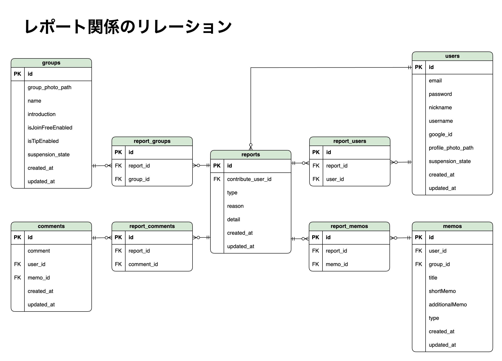

# ▫️ Basta

<p align="center" style="margin-bottom: 50px;">
    
</p>

<br/>

## ▫️ アプリURL

[https://basta.x0.com](https://basta.x0.com)

<br/>

## ▫️ サービス概要

Basta は、\
Webページや本から学んだことなどをメモとして管理し、グループで共有できるアプリケーションです。\
（自分専用のグループを作ることで、個人での使用も可能です。）

<br/>

## ▫️ アプリを作ったキッカケ

日々の学習で、役立つWebページや書籍を見つけても、記録しないとどこに何が書いてあったか忘れてしまい、毎回同じことを調べる羽目になる。\
そんな悩みを抱えている知り合いがいました。\
私自身も、せっかく学んだ内容をすぐに忘れてしまい、実生活に活かせていないことがもったいないと感じることがありました。\
<br/>

記録するとしても、学習とは関係のないメモと混ざって、どこにどの情報があるのか忘れてしまいます。\
その結果、学習・記録・復習のフローが一定でなくなり、習慣化するのも難しいなと感じていました。\
<br/>

そこで、学習記録だけを一つのシステムにまとめ、学習・記録・復習の際の余計な迷いをなくしたい。\
そして、その学習記録を仲間とシェアし、お互いの学びを深めたい。\
そんな思いから、Bastaを作りました。

<br/>

## ▫️ こんな方にピッタリかも

- 学習記録の方法・場所が統一されておらず、記録・復習の際に迷ってしまう方
- 学んだことを、気軽に仲間とシェアしたい方
- 既存のメモアプリでは操作が難しいと感じている方

<br/>

## ▫️ デモ手順
- [https://basta.x0.com](https://basta.x0.com)にアクセス（別タブで開いてください）

### Step 1: アカウント作成 & ログイン
- 『新規登録はこちら』をクリック
- 必要事項を入力して登録

### Step 2: グループ作成 / 入室
- 『グループをつくる』をクリック
- 必要事項を入力して作成
- 先ほど作成したグループの、『入室』ボタンをクリック

### Step 3: メモ投稿
- 『メモ投稿』をクリック
- web / 本 いずれかのタイプを選択し、必要事項を入力して投稿

### Step 4: いいね / あとでよむ
- メモの、『ハートマーク（いいね）』と『紙切れマーク（あとでよむ）』をクリック

### Step 5: ラベル作成 / 編集 / 削除 / 絞り込み
- 『ラベルを編集』をクリック
- 入力欄に好きなラベル名を入力して作成
- そのグループ内で作成されたラベル一覧が下に表示されるので、編集・削除できます。
- 画面左のラベル名で、OR検索の絞り込みができます。（何も選択していない場合、すべてのメモが表示されます）

### Step 6: メモ編集
- 先ほど作成したメモの、『編集する』ボタンをクリック
- 『ラベルを選択』をクリック
- ラベルを選択し、『メモ更新』をクリック

### Step 7: メモの詳細情報を見る
- 画面上部ヘッダーの、先ほど作成したグループの名前をクリックし、グループトップページに移動
- いずれかのメモの、タイトル部分をクリック
- メモの、『自由記入欄』で記載した内容はこのページでのみ見ることができます。

### Step 8: メモにコメントする
- このメモ詳細画面の、『コメントする』の下の入力欄に、好きなコメントを入力し、コメント作成

### Step 9: メモ or コメント の削除
- このメモ詳細画面で、三点リーダーから、メモやコメントを削除できます。（自分が投稿したもののみ）

### Step 10: メンバー画面
- いずれかのメモの、プロフィール画像 or ニックネーム or ユーザー名 いずれかをクリック
- そのメンバーが、そのグループ内で投稿したメモ一覧が表示されます。

### Step 11: マイページの便利機能を使ってみよう
- 画面上部ヘッダーの、『マイページ』をクリックし、マイページに移動
- 『自分が作成したメモ / いいねしたメモ / あとでよむしたメモ』で、メモを絞り込めます。
- 『グループで絞り込み』をクリックすると、自分が所属しているグループを選択して、メモを絞り込めます。\
  グループを選択している状態では、グループ内のラベルの操作（編集 / 絞り込み）もできます。

### Step 12: グループの管理者の便利機能を見てみよう
- 画面上部ヘッダーの、先ほど作成したグループの名前をクリックし、グループトップページに移動
- 画面右上の三点リーダー → 『グループ編集』をクリック
- 『メンバー編集』では、メンバーのブロック・強制退会・権限変更などができます。
- 『グループの自由参加』のトグルボタンは、グループ参加画面における『参加』ボタンの表示 / 非表示 を切り替えます。
- 『グループに招待する』は、指定したメールアドレスに、グループへの招待メールを送信できます。（『グループの自由参加』がOFFになっていても、招待されたユーザーは、グループに参加できます。）

### Step 13: ログアウト
- 画面右上の、プロフィール画像をクリック
- ログアウトをクリック

<br/>

## ▫️ 主なページと機能

<br/>

## ▫️ 使用技術

バックエンド

-   PHP 8.1.13
-   Laravel 9.52.5
-   Livewire 2.12.3
-   Jetstream 3.0.2
-   Laravel Socialite（Google OAuth 2.0 API を使用）

フロントエンド

-   HTML
-   CSS
-   Tailwind CSS 3.3.1
-   Alpine.js 3.12.0
-   JavaScript
-   Vite 4.2.1

データベース

-   開発環境: MySQL 5.7.39（MAMP）
-   本番環境: MySQL 8.0

インフラ

-   開発環境: Apache 2.4.54（MAMP）
-   本番環境: Apache 2.4.62

デザイン

-   Draw\.io

その他

-   PHPUnit, Git, GitHub

<br/>

## ▫️ ER図




<br/>

## ▫️ こだわった点

### 1. パフォーマンス

#### Eloquent クエリ最適化

**Livewireコンポーネントの効率化**
```php
// resources/views/livewire/good-button.blade.php

// 最適化前：各ボタンで毎回データベースクエリを実行
@if($memo->goods()->where('user_id', Auth::id())->exists())

// 最適化後：事前に計算したフラグを利用
@if($isGood)
```

いいね・あとでよむボタンにおいて、各コンポーネントが個別にクエリを実行していたところを、\
親コンポーネントで事前に一括取得した結果をフラグとして渡すことで改善しました。

**Eager Loadingによる関連データ一括取得**
```php
// app/Http/Livewire/MemoList.php

// 最適化前：複雑なJOINとSELECT文
Memo::with('labels')
    ->join('users', 'memos.user_id', '=', 'users.id')
    ->select('memos.*', 'users.nickname', 'users.username', ...)

// 最適化後：リレーションによる一括取得
Memo::with(['labels', 'user', 'goods', 'laterReads', 'web_type_feature'])
```

メモ表示時のクエリを、\
Eager Loadingを活用して関連データを一括取得することで改善しました。

**管理画面でのバルククエリ最適化**
```php
// app/Http/Livewire/GroupShowAdmin.php

// 最適化前：各ユーザーごとに通報数を個別クエリで取得
$users_data->each(function ($user) {
    $user->userReportsCount = User_type_report_link::where('user_id', $user->id)->count();

    $memoIds = $user->memo()->pluck('id');
    $user->memoReportsCount = Memo_type_report_link::whereIn('memo_id', $memoIds)->count();

    $commentIds = $user->comment()->pluck('id');
    $user->commentReportsCount = Comment_type_report_link::whereIn('comment_id', $commentIds)->count();
});

// 最適化後：バルククエリで一括取得
$userIds = $users_data->pluck('id');
$userReportCounts = User_type_report_link::whereIn('user_id', $userIds)
    ->selectRaw('user_id, count(*) as count')->groupBy('user_id')->pluck('count', 'user_id');
$memoReportCounts = Memo_type_report_link::whereIn('memo_id', Memo::whereIn('user_id', $userIds)->pluck('id'))
    ->selectRaw('memo_id, count(*) as count')->groupBy('memo_id')->pluck('count', 'memo_id');
$commentReportCounts = Comment_type_report_link::whereIn('comment_id', Comment::whereIn('user_id', $userIds)->pluck('id'))
    ->selectRaw('comment_id, count(*) as count')->groupBy('comment_id')->pluck('count', 'comment_id');

$users_data->each(function ($user) use ($userReportCounts, $memoReportCounts, $commentReportCounts) {
    $user->userReportsCount = $userReportCounts[$user->id] ?? 0;
    $user->memoReportsCount = 0;
    $user->commentReportsCount = 0;
    // 事前取得したデータから効率的に集計
});
```

管理画面でのユーザー通報数表示において、\
個別クエリからバルククエリへの変更により改善しました。

### 2. ユーザビリティ重視の設計
#### Ajaxによるスムーズな操作体験


Livewireを活用し、いいね・コメント・ラベル絞り込みなどの操作で
ページリロードを発生させず、快適な操作体験を実現しました。
特に学習記録という継続的な作業において、ストレスのない操作感を重視...

#### SNSログイン


プロフィール画面で、ご自身のGoogleアカウントと連携していただくことにより、\
次回以降のログインが非常にスムーズになります。

### 3. 健全性・品質向上のためのユーザー・運営連携
#### 【一般ユーザー側】
- 通報機能
- サービス自体の問題の報告やリクエスト、その他問い合わせができるフォーム

#### 【運営ユーザー側】
- 一般ユーザーの監視や利用停止、削除機能


<br/>

## ▫️ 今後の展望

### 1. 通知機能の実装

   現状、誰かのメモに対して『いいね』やコメントをしても、\
   アプリを開いて見に行く以外に、それに気づく方法がないため、\
   ユーザーの交流が途絶えてしまいます。

   そこで、以下のような通知機能の実装を計画しています。
   - 新しいコメントが投稿された際のリアルタイム通知
   - 通知の一覧表示機能
   - 通知の既読/未読管理

   これにより、グループ内のコミュニケーションをより円滑にし、\
   ユーザー間のやり取りを活性化させます。\
   <br/>

### 2. 時間がかかる処理の対策

   現在、メールの送信など一部の処理で時間がかかるなと感じることがあり、\
   その際、ユーザーに進行状況が伝わりにくい状況があります。

   そこで、以下のような対策を検討しています。
   - 処理中であることを視覚的に伝えるローディング画面を実装する
   - メール送信などの重い処理をキューに登録し、バックグラウンドで実行する

   これにより、ユーザビリティの向上を図ります。\
   <br/>

### 3. よりスムーズなグループ招待の実装

   現状、既にアプリに登録しているユーザーにしかグループ招待メールを送信できないため、\
   招待対象ユーザーがアプリに登録していない場合は、招待する側もされる側も、作業が多く大変です。

   そこで、招待対象ユーザーがアプリに登録していない場合は、\
   以下のようなスムーズな流れを実装します。

   > 1. 招待メールのURLをクリック
   > 2. アカウント作成画面に遷移
   > 3. アカウントを作成
   > 4. 自動的に対象グループに参加
  <br/>

### 4. CI/CDの導入

   本番環境へのデプロイ後、細かな修正が必要になった際に、\
   毎回手動でのデプロイ作業の手間を感じることがありました。\
   この課題を解決するため、CI/CDパイプラインの構築を計画しています。

   具体的には、以下のような自動化を検討しています。
   
   - フロントエンドの自動ビルド（Vite）
   - 自動テストの実行
   - 本番環境への自動デプロイ

   これにより、作業の抜け漏れを防ぐと同時に、開発に集中できる環境を整えます。
