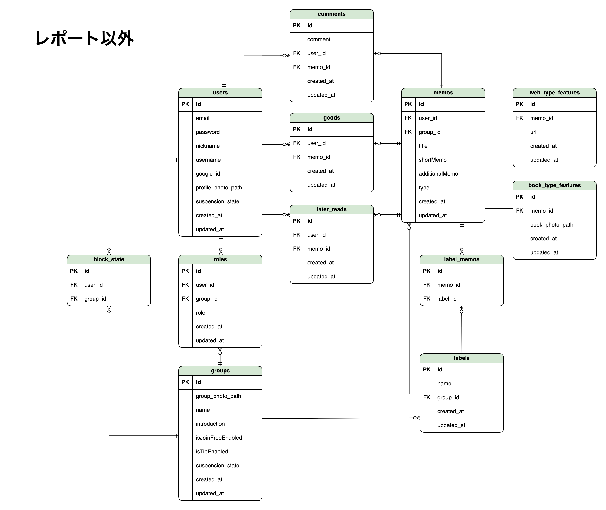

# ▫️ Basta

    

## ▫️ アプリURL

[https://basta.x0.com](https://basta.x0.com)

## ▫️ サービス概要

Basta は、\
Webページや本から学んだことなどをメモとして管理し、グループで共有できるアプリケーションです。\
（自分専用のグループを作ることで、個人での使用も可能です。）

## ▫️ サービスへの想い

## ▫️ 主なページと機能

## ▫️ 使用技術

バックエンド

-   PHP 8.1.13
-   Laravel 9.52.5
-   Livewire 2.12.3
-   Jetstream 3.0.2
-   Laravel Socialite（Google OAuth 2.0 API を使用）

フロントエンド

-   HTML
-   CSS
-   Tailwind CSS 3.3.1
-   Alpine.js 3.12.0
-   JavaScript
-   Vite 4.2.1

データベース

-   開発環境: MySQL 5.7.39（MAMP）
-   本番環境: MySQL 8.0

インフラ

-   開発環境: Apache 2.4.54（MAMP）
-   本番環境: Apache 2.4.62

デザイン

-   Draw\.io

その他

-   PHPUnit, Git, GitHub

## ▫️ ER図

## ▫️ こだわった点

## ▫️ 今後の展望

### 1. 通知機能の実装

   現状、誰かのメモに対して『いいね』やコメントをしても、\
   アプリを開いて見に行く以外に、それに気づく方法がないため、\
   ユーザーの交流が途絶えてしまいます。

   そこで、以下のような通知機能の実装を計画しています。
   - 新しいコメントが投稿された際のリアルタイム通知
   - 通知の一覧表示機能
   - 通知の既読/未読管理

   これにより、グループ内のコミュニケーションをより円滑にし、\
   ユーザー間のやり取りを活性化させます。\
    

### 2. 時間がかかる処理の対策

   現在、メールの送信など一部の処理で時間がかかるなと感じることがあり、\
   その際、ユーザーに進行状況が伝わりにくい状況があります。

   そこで、以下のような対策を検討しています。
   - 処理中であることを視覚的に伝えるローディング画面を実装する
   - メール送信などの重い処理をキューに登録し、バックグラウンドで実行する

   これにより、ユーザビリティの向上を図ります。\
    

### 3. よりスムーズなグループ招待の実装

   現状、既にアプリに登録しているユーザーにしかグループ招待メールを送信できないため、\
   招待対象ユーザーがアプリに登録していない場合は、招待する側もされる側も、作業が多く大変です。

   そこで、招待対象ユーザーがアプリに登録していない場合は、\
   以下のようなスムーズな流れを実装します。

   > 1. 招待メールのURLをクリック
   > 2. アカウント作成画面に遷移
   > 3. アカウントを作成
   > 4. 自動的に対象グループに参加
   

### 4. CI/CDの導入

   本番環境へのデプロイ後、細かな修正が必要になった際に、\
   毎回手動でのデプロイ作業の手間を感じることがありました。\
   この課題を解決するため、CI/CDパイプラインの構築を計画しています。

   具体的には、以下のような自動化を検討しています。
   
   - フロントエンドの自動ビルド（Vite）
   - 自動テストの実行
   - 本番環境への自動デプロイ

   これにより、作業の抜け漏れを防ぐと同時に、開発に集中できる環境を整えます。
